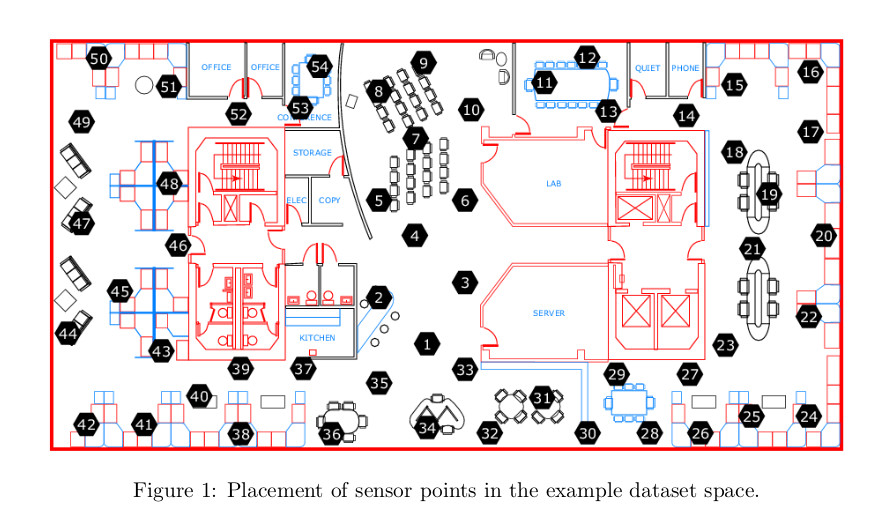

# Big Data Management and Analytics System (BDMAS) for Smart cities.

The Brussels government, wanting to lay claim to the title of smart city, has initiated a project where it will equip a modest number of households and public buildings with such sensors. The project consists in implementing a Big Data Management & Analytics (BDMA) platform that will store, manage and analyze this sensor data.
The project is divided into two phases:
1. In Phase I, you need to design the Big Data Management pipeline that will be used to store and manage the sensor data, as well as implement certain batch and streaming queries for the pipeline in order to show its feasibility.
2. In Phase II, you will employ Machine Learning methods on actual sensor data in order to build a model of the data that can be used for predictions.

## Big Data Management pipeline (Phase I)
Consists in implementing batch and streaming queries to show feasibility.

### Data

- **Spaces**: Represent a physical space.
    - ID : 
    - META-DATA: 
    - For each participating space the identifiers of the sensors located in the space must be stored, as well as their coordinates x,y w.r.t "base coordinate".
    - 10000 spaces involved

- **Sensors**:
    - ID
    - Types:
        - Temperatures: Float C
        - Humidity: FLoat %
        - Light: Float Lux
        - Movement: Boolean
    - Voltage: indicating the battery level
    - For each sensor we must store its type.
    - Send that +/- every 30 seconds.

Data / min = # spaces x # sensors x 60s/30s

#### Research Lab Example

- Divided into 54 points
    - Each point equipped with 3 sensors:
        1. p-0 : temperature
        2. p-1 : humidity
        3. p-2 : light
    - total number of sensors = 54 x 3 = 162

#### Log Format

- Date: yyyy-mm-dd, 2019-02-01, First of February 2019

- Time: hh:mm:ss.xxxx, 10:15:10.1234, 10 am 15 minutes 10.1234 seconds

- SensorID: p-i, p belongs [1-54], i belongs [0-2]

- Measurement: real number

- Voltage: real number in volts

`Note`: sometimes sensors does not report a measurement each 30 seconds.

### Requirements

- Develop a BDMA pipeline
    - Store Data
    - Manage Data
- Web based dashboard

#### Queries

1. Statistics (Max, Min, AVG) of sensor readings per type. Can be grouped by:
    - Granularity in space
        - per space / municipality/ entirely Brussels
    - Granularity in time
        - Last x hours / days / months / years
    - Ex. Max **temperature value** in the **research Lab** in the **last 5 hours**.

2. For each slot of 15 minutes in a day 
    - If average temperature over +/- 30 measurements >= 19 C : daytime
    - If average temperature over +/- 30 measurements < 19 C : nighttime
    - Explanation:
        - 24h / day
        - 15 minutes slots
        - total = 96 slots / day
        - Ex. 00h00 to 00h15, corresponds to the first slot of the day
    - Grouping : results can be **"Rolled up"**
        - time
            - last n days of x min/ hours slots
            - last n weeks of x min / hours/ days slots
            - last n months of x min / hours / days / weeks slots
            - last n years of x min / hours / days / weeks / months slots
        - space
            - all sensors in a specific space / municipality / entire Brussels
3. Overview of frequent temperature values within 1 hour sliding window over the data stream.
    - Set frequent threshold, Ex. theta = 100
    - Can consider 19.439 and 19.42 the same measurement (different decimals).

#### Considerations

- Streaming Data +/- every 30 seconds
- Query and analysis should be implemented in **Spark Streaming**
- Save data for the past 10 years
- Real time dashboard 
- Describe in the report which sets of technologies we will use and explain why.
- Research about alternatives to lambda-architecture and evaluate which one we will use and justify why.
- Specify in the report any assumption about the data.
- Design a scalable platform and do an analysis of the expected data volumes in function of the number of sensors per space.

### Deliverables

- `Deadline`
    - Friday, Third of may 2019

- **Code**
    - README file
    - Requirements for installation
- **Report**
    - General
        - Analysis
        - Motivation
        - Description of design
    - Specific
        - Overall architecture BDMA pipeline (Ex. Lambda-architecture)
        -  For each component of the architecture
            - Description of functional purposes
            - Discussion of the set of possible technologies
            - Technology that was selected with a motivation
            - Any additional assumption w.r.t. data set
            - Data volumes analysis
            - For each query a description of how they were implemented
            - Description of the Dashboards implementation and a screenshot
    

### Installation
